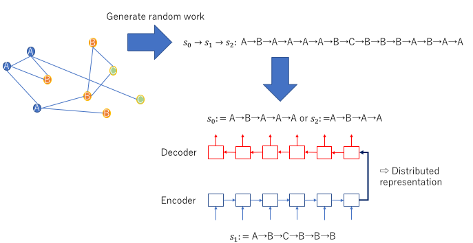

<!-- $theme: default -->

# SKIP-GRAPH: LEARNING GRAPH EMBEDDINGS WITH AN ENCODER-DECODER MODEL

###### Created by Takeshi Oura

---

# Agenda

- SKIP-GRAPH: LEARNING GRAPH EMBEDDINGS WITH
AN ENCODER-DECODER MODEL,Lee et al. 2016
(ICRL 2017 under review)
- グラフの埋め込み表現を抽出
- ノードを辿るランダムウォークとしてグラフを表現しRNNで系列の埋め込み表現を学習
- 原子配列から性質を同定するタスクで評価

---

# Graph

あらゆるデータ構造、情報はグラフで表現できる(というのは言いすぎ?)
- グラフ中のノードに着目
	- ノードのラベル付与問題
	- クラスタリング、コミュニティ抽出、ソーシャルネットワーク上のユーザプロファイルの推定
	- node2vec: グラフ中ノードの埋め込み表現 (Grover et al.2016)
- グラフ全体に着目
	- グラフ自体のラベル付与
	- 構文木からの推定、分子配列から構造、機能予測
	- グラフ全体の埋め込み← 本論文
	

---
# Settings
- 入力: 複数のグラフ
	- 無向グラフ
	- ラベルつきノード
	- ラベルつきエッジでもよい
(この場合ノード，エッジの系列を考える)
	- ラベルは何らかの素性でよい
- 出力: 各グラフのベクトル表現
	- ラベルつきのノードにより構成させるグラフの構造を反映したい

---
# Idea 

- グラフの構造をランダムウォーカーによるノードの系列で表現
- ノードの列を入力としたencoder-decoderモデルで内部表現を学習
- 学習時のencoder-decoderモデルのskip-gram(seqence入力word2vec)
- RNNとしてはGRUを使用
 
###### Graph laplacianやSpectrum methodは扱わないが当然グラフ上のランダムウォークとは関係が深い

---
# Skip-graph vector
- skip-gram: 単語$w_i$からcontext: $w_{i+1}, w_{i-1}$を予測
- skip-thought (Kiros et al. 2015): sequence $s_i$からcontext: $s_{i+1}, s_{i-1}$を予測, sequence入力なのでencoder-decoder
- skip-graph: グラフ上のランダムウォーク$s$を$s_{pre}\to s_{input}\to s_{post}$のように分解, $s$から$s_{pre},s_{post}$を予測

# 

---
# Algrothm

1. 各グラフごと$K$個のランダムウォークを生成
2. ランダムウォークでencoder-decoderを学習
3. ベクトル表現抽出:
	1. 各グラフごと$K'$個のランダムウォークを生成
	2. encoderでベクトル表現を出力
	2. $K'$個のベクトル表現を合算
	

- ベクトル表現の合算方法
	- Single walk: 十分に長い系列1つのみ生成し使う($K'=1$)
	- Average:次元ごとに平均
	- Max: 次元ごとにMax
	- Cluster: k-means → bug of cluster

---

# Evaluation

- Task:
	- 化合物が与えられターゲットの病気に効果があるか2値識別する
	- dataset: NCI81, NCI83, NCI123, HIV
- 比較手法:
	- ECFP: Extended-connectivity circular fingerprints, 各ノードからk近傍の分子に着目し、iterativeにノードの素性を更新しhash関数で固定長ベクトルに変換
	- NeuralFPS: ECFPをCNNにしたもの
	- Skip-graph: 提案手法

###### 素性抽出後svmで識別機を構築

---

# Results

- 既存手法との比較
	- すべてのデータセットで既存手法を上回る

|method|HIV|NCI81|NCI83|NCI123|
|:-:|:-:|:-:|:-:|:-|
|ECFP|68.30%|68.90%|62.06%|60.16%|n
|NeuralFPS|67.48%|65.24%|59.91%|60.00%|
|Skip-graph|**71.76%**|**70.56%**|**64.04%**|**64.32%**|

- 合算方法の比較
	- Single walkは非常に悪い
	- それ以外はだいたいよい

---

# まとめ

- グラフの埋め込み表現を抽出した
- グラフ構造をランダムウォークで表現
- 系列の埋め込み表現を抽出するskip-thoughtでランダムウォークから埋め込み表現を学習
- 化合物の機能予測タスクにおいて既存手法を上回る結果を得た

---

